# PROYECTO UNIDAD 4 - Pochi Team

## Autores

- Victor Sánchez Nogueira
- Joel Figueirdo Molares
- Amán Lama Vilariño

## Índice

1. [Introducción](#1-introducción)
2. [Supuesto](#2-supuesto)
3. [Diagrama_CFM](#3-diagrama-CFM)
4. [Manual técnico para desarrolladores](#4-manual-técnico-para-desarrolladores)
5. [Manual de usuario](#5-manual-de-usuario)
6. [Explicación de GitProject](#6-explicacion-de-gitproject)
7. [Extras realizados_y tests](#7-extras-realizados-y-tests)
8. [Propuestas de mejora](#8-propuestas-de-mejora)
9. [Conclusión](#9-conclusión)

## 1. Introducción

En este proyecto se usa el framework de SpringBoot para desarrollar una aplicación web que permita gestionar una base de datos de una web de enfermedades. La aplicación permite realizar operaciones CRUD sobre las tablas de la base de datos, así como también realizar donaciones a los diversos pacientes que se encuentran en la base de datos.

## 2. Supuesto

La base de datos que hemos usado es una que trata sobre información de enfermedades, que a través de sus atributos puedes percatarte de su peligrosidad, si es contagiable, de su nombre, entre otros datos interesantes. Por otra parte, están los medicamentos, que se relacionan en una tabla de muchos a muchos con enfermedades, dado que una enfermedad puede ser tratada por varios medicamentos y varios medicamentos pueden tratar una sola enfermedad. Respecto a la información detallada del medicamento podemos encontrar su precio, si es recetable o su descripción.

Además de estas dos entidades principales, también tenemos los pacientes, los cuales padecen una enfermedad (un paciente puede padecer una única enfermedad, pero varios pacientes pueden padecer la misma enfermedad). Estas personas tienen atributos como el nss, la imagen de perfil, la edad y el objetivo de la donación que quiere recaudar. Para gestionar esta lógica todos los pacientes tienen asociada a sí mismas una tarjeta individual y exclusiva para cada uno, donde se guardarán los datos primordiales para poder realizar las donaciones, como por ejemplo su cuenta bancaria.

En cuanto a la lógica de los usuarios, esta es muy simple, ya que existen tres tipos de roles: en primer lugar está el usuario normal y corriente que puede consultar las enfermedades y donar, en segundo lugar está el usuario bloqueado el cual no puede iniciar sesión porque su estado, y finalmente está el usuario administrador, el cual mediante sus privilegios puede realizar el CRUD de todas las entidades (paciente, medicamento, enfermedad) y gestionar los permisos de los usuarios. 

Finalmente, cabe destacar la relación entre los usuarios y las tarjetas que es la relación de muchos a muchos donde se gestiona toda la lógica de las donaciones. En esta tabla se guardan la cantidad donada, la fecha y las respectivas ids de ambas entidades que participan en esta relación. Por otra parte, también hay que recalcar que la lógica de un usuario asignado a un paciente se guardará en esta tabla, es decir, tú eres un usuario de la web de enfermedades y al mismo tiempo eres un paciente con tu propio perfil el cual puedes editar con gusto, siempre y cuando un administrador te haya asignado y creado tu tarjeta.

## 3. Diagrama CFM

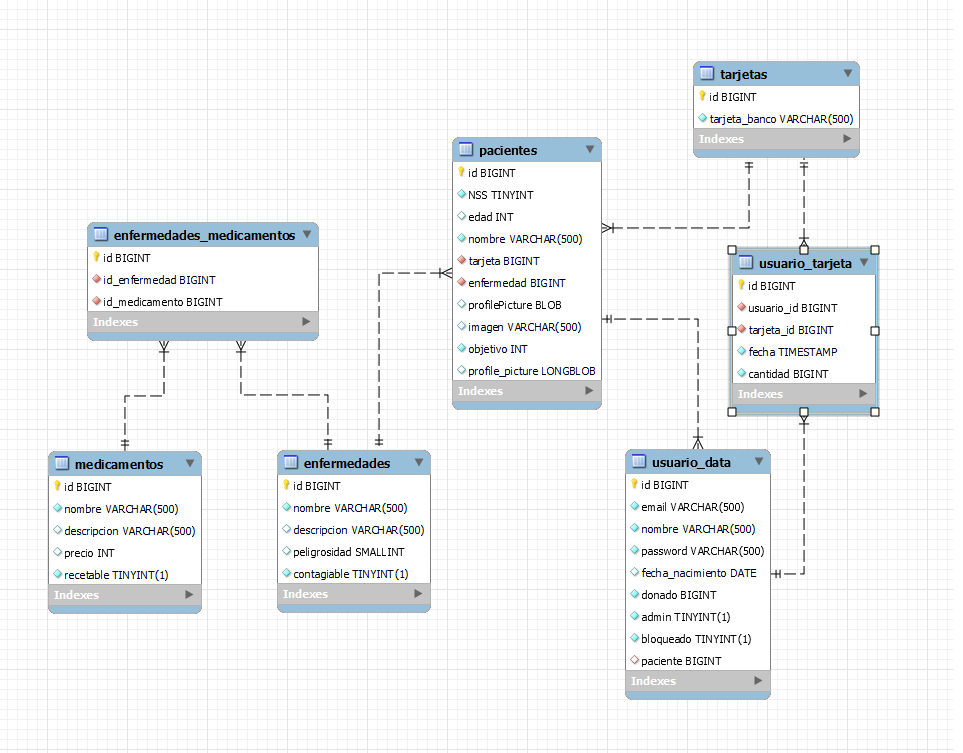

## 4. Manual técnico para desarrolladores

Para comenzar con la web de Pochi-Health, sigue estos pasos:

### Requisitos
Necesitas tener instalado en tu sistema:

- Java 17

### Pasos
1. Clona el repositorio:
    ```sh
    git clone https://github.com/CGAInstitution/proyectoud4-pochi-team.git
    ```

2. Navega al directorio del proyecto:
    ```sh
    cd proyectoud4-pochi-team
    ```

3. Construye el proyecto usando Maven:
    ```sh
    mvn clean install
    ```

4. Ejecuta la aplicación:
    - Puedes ejecutar la aplicación usando el _goal_ `run` del _plugin_ Maven de Spring Boot:

5. Ve a la pagina de inicio:
    - [http://localhost:8080/](http://localhost:8080/)

### Explicación Código Fuente

En esta sección tenemos una funcion que recorre todos los pacientes, convierte la lista en un stream, filtra por los pacientes que ahún no hayan completado su objetivo, los va comparando para ordenarlos por los que llevan mayor porcentaje, corta el stream a los 5 pacientes, y lo convierte a lista para mayor encapsulación:

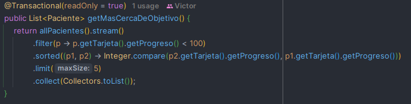

En el siguiente codigo usamos el PacienteDTO para poder validar los datos del paciente antes de modificarlos, para ello usamos @Valid, este decorador irá a la clase PacienteDTO para comprobar que los datos que le pasamos a este objeto desde la vista .html son correctos segun los decoradores de esta clase (PacienteDTO.java), con el resoult haremos un check de que todo este correcto, de lo contrario volveremos al formulario y le damos los atributos necesarios al modelo, en el caso de que no haya errores en la validación cogeremos el paciente con el id asignado al parametro idPaciente, cambiaremos sus datos por los del DTO y los guardaremos:

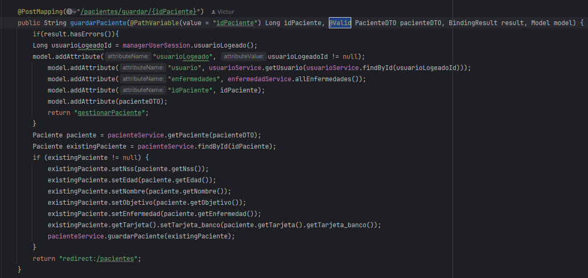

## 5. Manual de usuario

https://drive.google.com/file/d/1n93579XiK7Vagj9zg7r_3oINfM8ITbDO/view?usp=drive_link

Es el segundo vídeo, ibamos con prisa y se nos coló uno.

## 6. Explicación de GitProject

Hemos usado múltiples ramas para el desarrollo de este proyecto usando la lógica de GitFlow (una rama main donde se publican las versiones para producción, una rama develop donde se hacen los cambios y publicamos versiones estables y las ramas feature que usamos para implementar nuevas funciones), con estas técnicas hemos centrado las issues en los pull request, en los features y en los fixes. 

Gracias a esta lógica nos hemos podido centrar mucho mejor en las tareas que tenía que realizar cada uno por su cuenta, dado que al ser un trabajo de tres integrantes necesitabamos tener una buena gestión de las partes que debíamos codificar. Las issues que hemos ido creando con el tiempo se le han asignado una o varias personas para realizar la actividad en cuestión, junto a el tipo de issue que era (feature o fix). Según la complejidad e importancia de esta tarea hemos optado en cada caso por crear una rama feature o no, como por ejemplo la tarea de conectar la api tiene su propio rama feature, pero en cambio la tarea de añadir la barra de progreso al ser una tarea con tan poco valor se ha realizado en la propia rama develop.

Como conclusión sobre este apartado, nos ha parecido una manera bastante óptima y adecuada a los proyectos grandes que tengan varios integrantes, dado que nos ha ayudado mucho a mejorar la comunicación mediantes las tareas y el entendimiento de las actvidades que tuvimos que hacer cada uno por nuestra cuenta. En cuanto los pull request, cabe destacar que al principio nos costó un poco entenderlos, pero luego nos dimos cuenta de su gran efectividad para mejorar la lógica de GitFlow y facilitarnos la vida a la hora de mergear ramas y solucionar conflictos de estas.

## 7. Extras realizados, tests y aws

Imágenes que verifican que funcionan los tests y aws:

### Prueba funcionan los tests

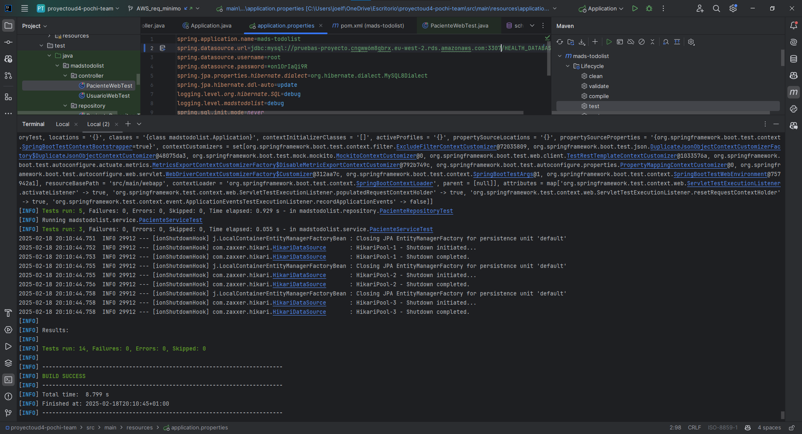

### Prueba funciona aws

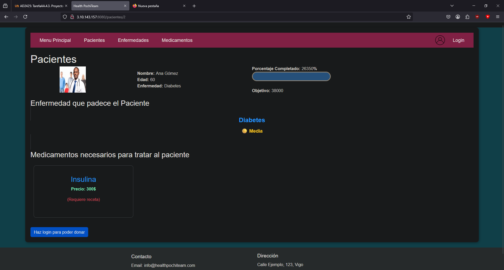

Conjuntamente hemos realizado los siguientes extras:

### Validación formularios (3%)

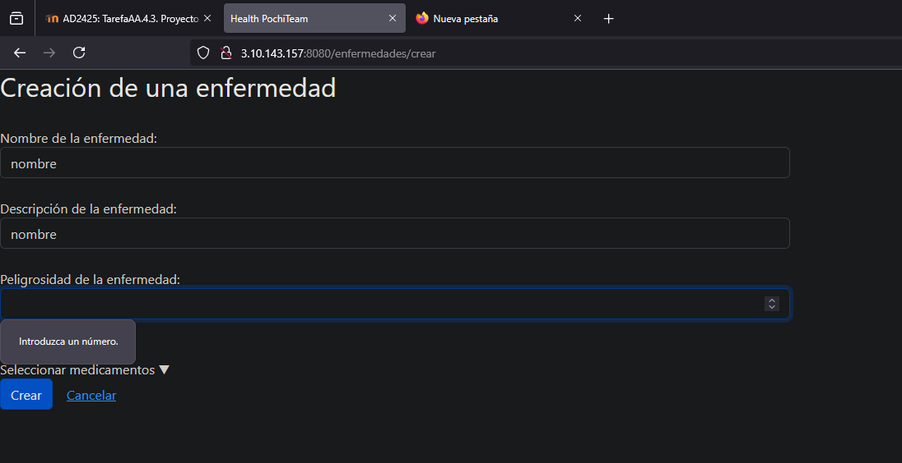

En esta imagen se puede ver un pequeño ejemplo de la validación de campos, claramente están todos los campos validados no únicamente ese.

### Creación de un RestController (5%)

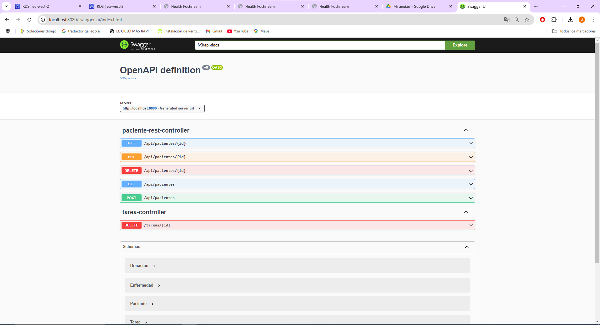

### Despliegue con Docker (10%)

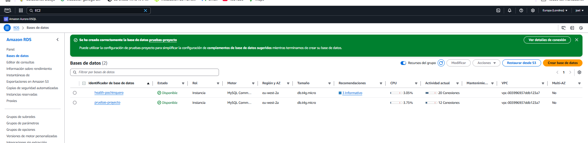

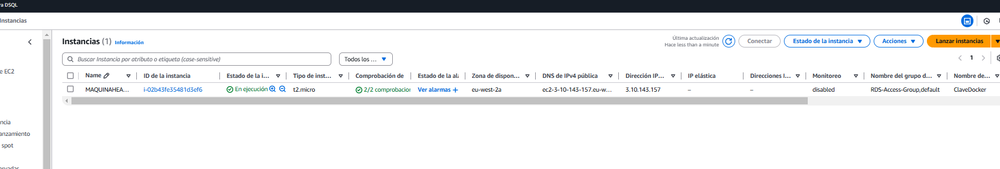

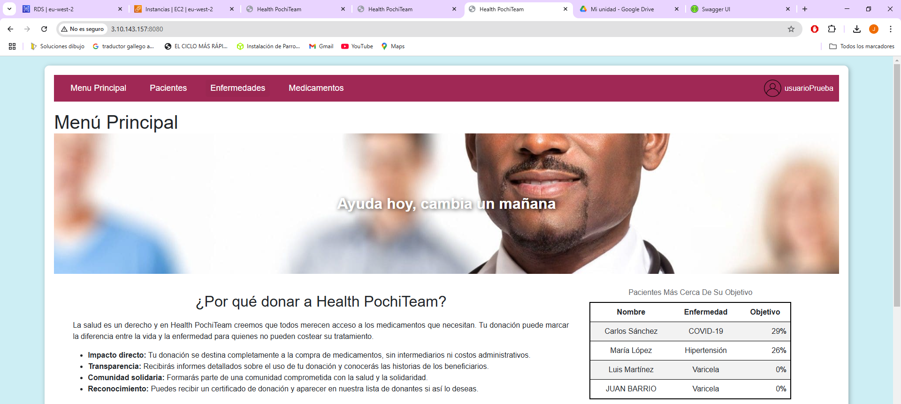

El video se ha realizado con docker desplegado

### Dashboard para el administrador (3%)

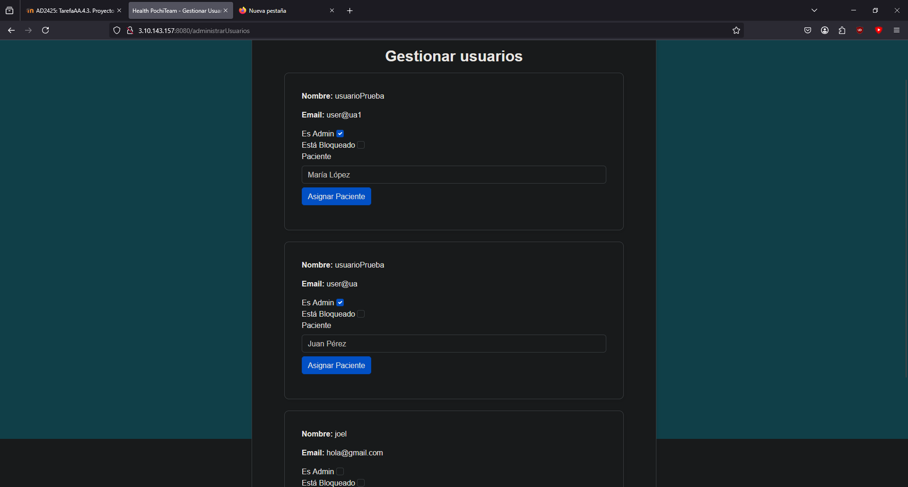

## 8. Propuestas de mejora

### Nuevas Opciones
- Hacer que los usuarios pudiesen ver sus donaciones, más los datos de estas.
- Utilizar hilos para mejorar el rendimiento de la web y la transferencia de datos

### Control De Errores
- Utilizar el DTO para el resto de las clases y asi poder validar sus datos
- Utilizar mas fragments para aumentar la legibilidad

## 9. Conclusión

### Conclusiones
- El proyecto ha permitido adquirir conocimientos esenciales sobre el uso de Spring Boot y Thymeleaf para el desarrollo de aplicaciones web.
- Se ha logrado implementar una aplicación funcional que gestiona pacientes, incluyendo funcionalidades como la gestión de donaciones y la carga de imágenes de perfil.
- La estructura del proyecto y el uso de DTOs han mejorado la validación de datos y la organización del código.
- Se han identificado áreas de mejora, como la implementación de hilos para mejorar el rendimiento y el uso de más fragments para aumentar la legibilidad del código.
- La experiencia adquirida en este proyecto proporciona una base sólida para futuros desarrollos en Spring Boot y aplicaciones web en general.

### Opinion Del Trabajo Realizado
- Aunque creo que habría sido idoneo haber realizado mas pruebas y profundizado mas en el tema de Spring, creo que gracias al proyecto adquirimos los conocimientos necesarios para poder entender y manipular un proyecto de Spring

### Dedicación Temporal y Cualificación Estimada

Todos los integrantes del equipo nos hemos esforzado mucho en el desarrollo de este programa, tanto con el trabajo de clase junto a las horas invertidas en casa. Algunos hemos dedicado más horas en casa y otros en clase pero más o menos entre todos sumamos más de 80 horas contando el arduo trabajo de Joel en las clases porque por arte de magia la aplicación le explotaba de un momento a otro y las numerosas noches en vela de nuestro compañero Víctor solucionando los errores garrafales que habían hecho Amán y Joel por la mañana. Dado esta pequeña conclusión y todos los extras que hemos realizado juntos a tomarnos a raja tabla los requisitos del enunciado del proyecto estimamos que tendremos un 8'25 o un 9 si no se nos penaliza ni a nuestro grupo ni a ninguno de los de clase por usar varios services en los múltiples controllers.